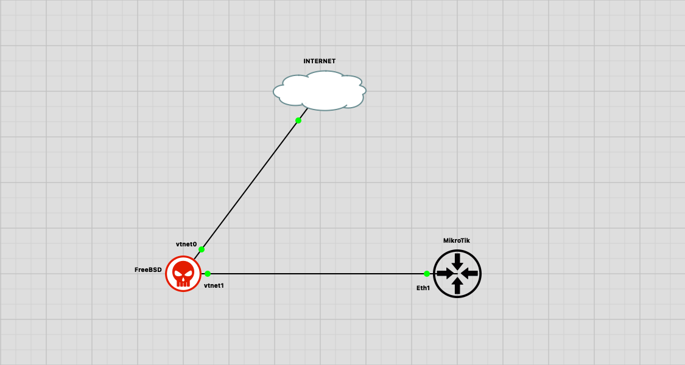
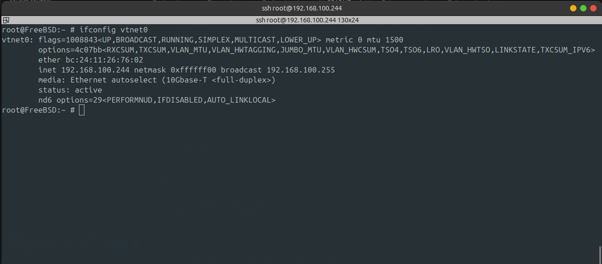
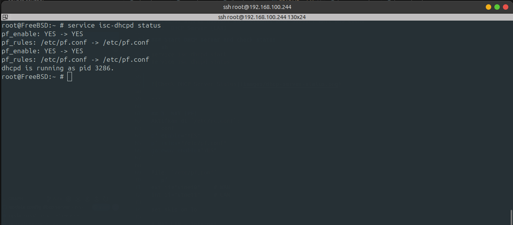
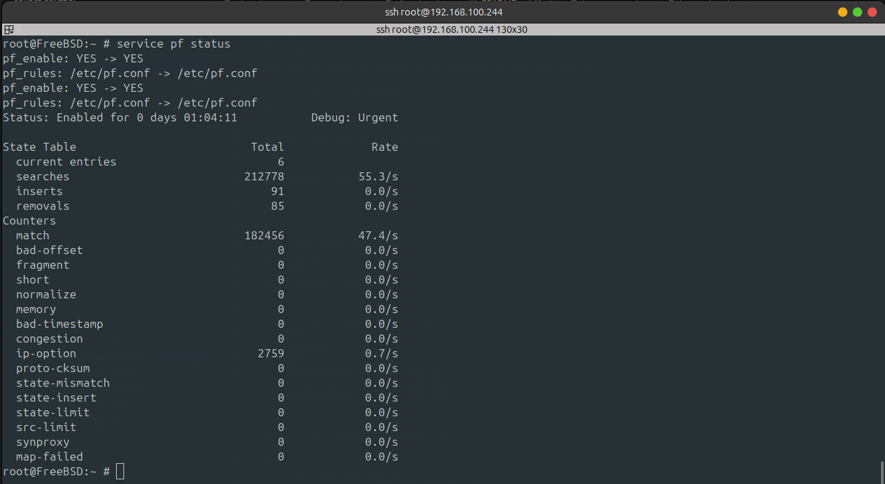
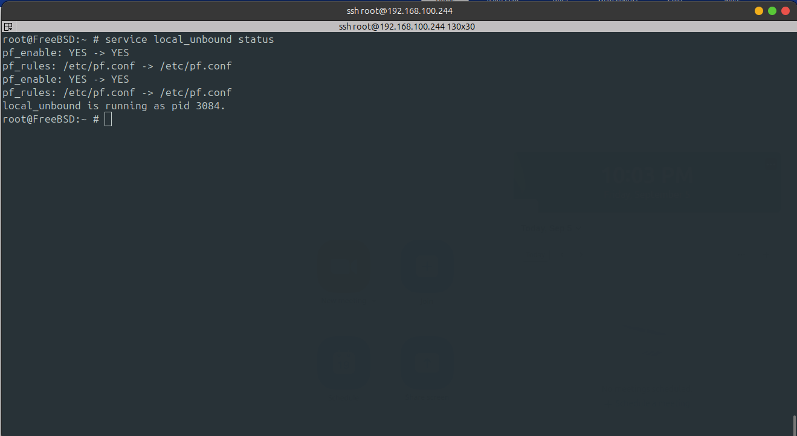

# FreeBSD SIMPLE ROUTER: DHCP Client, DHCP Server, NAT, DNS Cache

## Topology



---

## 1. DHCP Client (WAN)
Edit `/etc/rc.conf`:
```conf
# DHCP CLIENT vtnet0 (WAN)
ifconfig_vtnet0="DHCP"
```

Restart networking:
```sh
service netif restart vtnet0
```

Check IP:
```sh
ifconfig vtnet0
```


---

## 2. DHCP Server (LAN)
### Install ISC DHCP server
```sh
pkg install isc-dhcp44-server
```

### Config file `/etc/rc.conf`
```conf
# DHCP SERVER vtnet1 (LAN)
ifconfig_vtnet1="inet 172.31.0.1 netmask 255.255.255.0"
dhcpd_enable="YES"
dhcpd_ifaces="vtnet1"
```

### Config DHCP server
File: `/usr/local/etc/dhcpd.conf`
```conf
default-lease-time 600;
max-lease-time 7200;
authoritative;

subnet 172.31.0.0 netmask 255.255.255.0 {
  range 172.31.0.2 172.31.0.254;
  option routers 172.31.0.1;
  option domain-name-servers 172.31.0.1;
}
```

### Start DHCP server and check status
```sh
service isc-dhcpd start
service isc-dhcpd status
```



---

## 3. NAT (PF)
Enable in `/etc/rc.conf`:
```conf
# PACKET FILTER
pf_enable="YES"
pf_rules="/etc/pf.conf"

# IP fORWADING 
gateway_enable="YES"
```

File: `/etc/pf.conf`
```conf
# Interface definitions
ext_if = "vtnet0"   # WAN
int_if = "vtnet1"   # LAN

# Skip loopback
set skip on lo

# NAT all traffic from LAN to Internet
nat on $ext_if from $int_if:network to any -> ($ext_if)

# Allow LAN -> Internet
pass out on $ext_if from $int_if:network to any keep state

# Allow LAN -> RO-FreeBSD
pass in on $int_if
```

Reload rules and check the status:
```sh
service pf restart
service pf status
```



---

## 4. DNS Cache (Unbound)
Enable in `/etc/rc.conf`:
```conf
# LOCAL UNBOUD (DNS RESOLVER)
local_unbound_enable="YES"
```

File: `/var/unbound/forward.conf`
```conf
forward-zone:
	name: "."
	forward-addr: 8.8.4.4
	forward-addr: 1.1.1.1
	forward-addr: 8.8.4.4
```

File: `/var/unbound/lan-zones.conf`
```conf
# This file was generated by local-unbound-setup.
# Modifications will be overwritten.
server:
	# Unblock reverse lookups for LAN addresses
	unblock-lan-zones: yes
	insecure-lan-zones: yes
	
	# Allow LAN
	interface: 0.0.0.0
	access-control: 127.0.0.0/8 allow
	access-control: 172.31.0.0/24 allow
```

Restart Unbound and check the the status:
```sh
service local_unbound restart
service local_unbound status
```



---

## 5. Final version rc.conf
`/etc/rc.conf`:
```conf
hostname="FreeBSD"
sshd_enable="YES"
moused_nondefault_enable="NO"
# Set dumpdev to "AUTO" to enable crash dumps, "NO" to disable
dumpdev="AUTO"
zfs_enable="YES"

# DHCP CLIENT vtnet0 (WAN)
ifconfig_vtnet0="DHCP"

# DHCP SERVER vtnet1 (LAN)
ifconfig_vtnet1="inet 172.31.0.1 netmask 255.255.255.0"
dhcpd_enable="YES"
dhcpd_ifaces="vtnet1"

# IP FILTER
sysrc pf_enable="YES"
sysrc pf_rules="/etc/pf.conf"

# PACKET FILTER
pf_enable="YES"
pf_rules="/etc/pf.conf"

# IP fORWADING 
gateway_enable="YES"

# LOCAL UNBOUND (DNS RESOLVER)
local_unbound_enable="YES"
```

---

## 5. Testing
